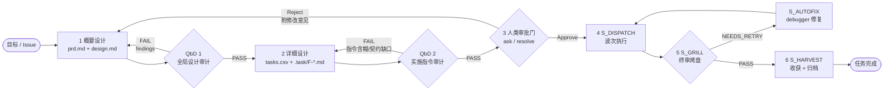
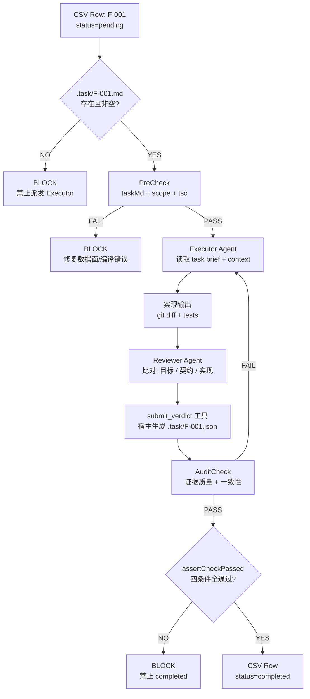
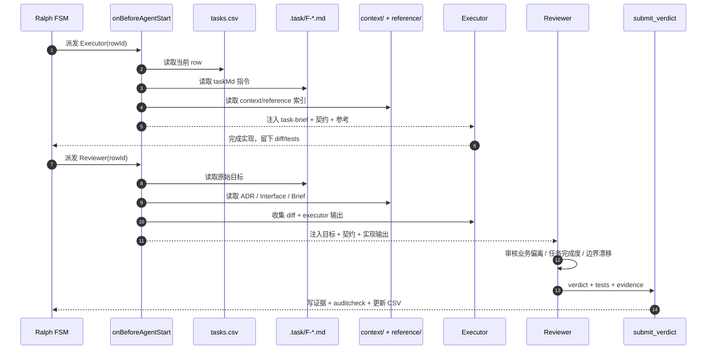
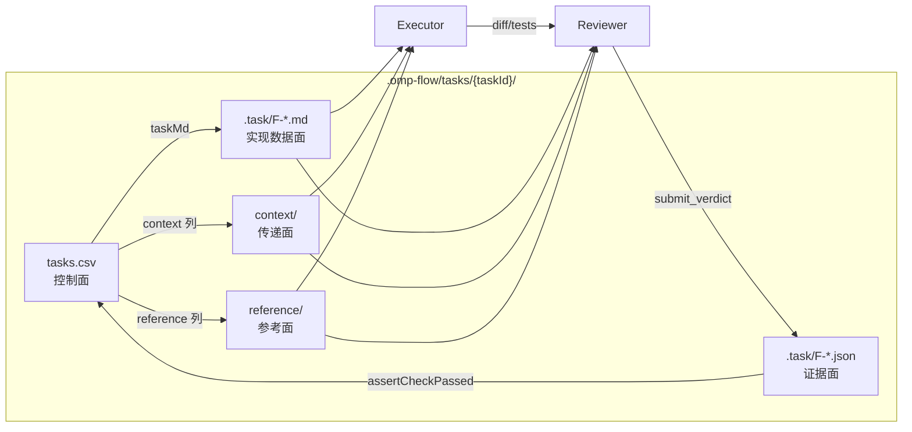
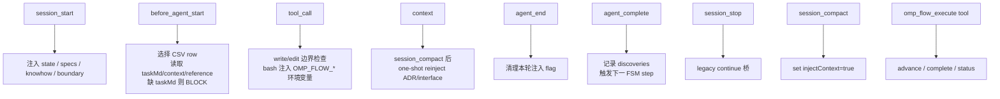
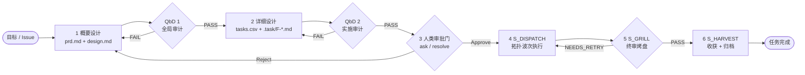

# omp-flow 🚀

> **原生支持 Oh-My-Pi (OMP) 的多 Agent 工作流编排框架**  
> **Multi-Agent Workflow Orchestration Framework powered by Oh-My-Pi (OMP)**  
> 融合 **Trellis**（分层规约上下文 & 动态提示词注入）与 **Maestro-Flow**（精简 4-State FSM 引擎、边界契约防漂移 & 增量 Harvest 踩坑闭环），实现零外部依赖、高并发、自进化的多 Agent 协作范式。

---

## 🌟 核心亮点 (Key Features)

- **⚡ 零外部运行依赖 (Zero External Dependencies)**
  纯 TypeScript 原生编写（NodeNext 模块），无需 Python、SQLite、C 编译扩展或向量数据库。一个 `npx` 指令开箱即用。

- **📦 OMP 原生声明式打包 (Declarative Packaging)**
  通过 `package.json` 的 `omp.extensions` + `omp.skills` 字段声明扩展入口与技能包，OMP 运行时自动发现加载。**无需 installer 胶水层**，`omp plugin link` 或 npm install 即可使用。

- **📂 自包含 Task 工作区 (Self-Contained Task Workspace)**
  每个 Task 拥有独立目录，包含 PRD、设计、CSV 调度器、实现数据面、调研报告与**专属上下文传递面**。任务归档时整套目录一键移入 `archive/`，零残留。

- **🔄 精简 4-State FSM 驱动引擎 (Streamlined 4-State FSM)**
  采用确定性的 **`PLANNING` ➔ `DISPATCH` ➔ `GRILL` ➔ `HARVEST`** 四阶段流水线，Ralph FSM 作为持久化内部状态机，支持断点续跑。

- **🧠 专属上下文传递面 (Dedicated Context Plane)**
  每个任务目录下独立的 `context/` 子系统，存储跨 Agent、跨 Row 传递的**结构化事实工件**（接口契约、ADR 决策、Brief、Findings），通过 `tasks.csv` 的 `context` 索引列精准引用。**彻底告别全局 `discoveries.ndjson` 盲塞噪声**。

- **📋 标准化传递工件模板 (Standardized Context Templates)**
  所有写入 `context/` 的工件必须遵循 `templates/context/` 下的标准模板（ADR、接口契约、Brief、Finding），确保 Agent 产出规范、机器可解析、人类可审计。

- **🛡️ 静态 + 动态双重防漂移 (Dual-Layer Drift Protection)**
  前置注入 `<subagent-boundary-context>` 契约约束；运行时由 OMP `HookAPI` 实时拦截 `write`/`edit` 工具调用并进行通配符 Glob 路径匹配警报。

- **🧠 OMP 多模型分级调度 (Model Tiering)**
  根据 Subagent 职责自动匹配最佳模型档位：`smol`（快速低成本）、`default`（标准推理）、`slow`（高推理大容量）。

- **🌾 踩坑闭环与自强化学习 (Self-Reinforcing Harvest Loop)**
  自动提取 Subagent 调试日志中的 Gotchas/Recipes，增量去重回写至 `knowhow/` 和 `specs/`，并在新会话启动时自动注入提示词，实现"越用越聪明"。

---

## 🎯 设计哲学 (Design Philosophy)

`omp-flow` 基于 **六大核心设计原则** 构建：

### 1. 质量源于设计 (Quality by Design / QbD)

每个 Task 启动前，`omp-flow-architect` 输出 `prd.md` + `design.md` 后，**QbD Advisor** 自动发起对抗式审计，审计未通过则打回重写。

### 2. 控制面、数据面、传递面与参考面四层解耦

将任务控制流、实现数据、传递上下文与外部参考彻底解耦，构建高内聚自包含的 Task 工作区：

```text
.omp-flow/tasks/<task-slug>/
├── prd.md                 <-- [业务与全局边界] 目标、Acceptance Criteria、Out-of-Scope (What)
├── design.md              <-- [QbD 架构设计] 方案、接口描述、关键决策 (How)
├── tasks.csv              <-- [控制面调度器] 状态流转、波次、Tier、reference/context 索引列
├── .task/                 <-- [实现数据面] 落地具体任务实现要求 (T1.md) 与测试硬证据 (T1.json)
├── reference/             <-- [二级参考面 (Digested References)] 消化后的代码切片、配置规范、原始文件锚点
├── research/              <-- [调研产出面] Researcher 子 Agent 持久化的调研分析报告
└── context/               <-- [三级传递面 (Distilled Context)] 跨 Agent 传递的结构化事实工件 (ADR/接口/Brief)
    ├── index.json         <-- 传递工件索引注册表
    ├── brief/             <-- 模块 / 任务 Brief (.md)
    ├── interface/         <-- API / 接口契约文档 (.md)
    ├── decision/          <-- 架构决策 ADR 文档 (ADR-*.md)
    └── finding/           <-- 精炼实施 / 调研发现 (.md)
```

| 层级 | 载体 | 职责 | 优势 |
|------|------|------|------|
| **控制面 (Control Plane)** | `tasks.csv` | 状态流转、波次排程、模型阶梯、**`reference` 与 `context` 索引列** | 单一真理看板，解析高效，天然抗 Compaction |
| **实现数据面 (Data Plane)** | `.task/T*.md` + `.task/T*.json` | 实现 Markdown 指令、伪代码 + Reviewer 独立 Check 硬证据 | 无 CSV 转义噩梦，表达力封顶 |
| **二级参考面 (Reference Plane)** | `reference/` 目录 | 消化提取后的关键代码切片、配置范式，带有指向一级原始库的 `file:line` 锚点 | 站在巨人的肩膀上，拒绝闭门造车 |
| **三级传递面 (Context Plane)** | `context/` 目录 | 跨 Agent 传递的**结构化事实工件**（接口契约、ADR、Brief、Finding） | 任务级隔离，精准索引，零噪声注入 |

### 3. 分级参考数据库与“消化”工作流 (Multi-Tier Reference & Digestion Pipeline)

没有任何 Agent 应该在真空里闭门造车。“没有调查就没有发言权”。omp-flow 借鉴生物学一级/二级数据库分级思想，建立完整的参考消化流水线：

```text
[一级全量库 Tier 1] ──► [二级消化切片 Tier 2] ──► [三级结构化契约 Tier 3] ──► [CSV 调度器] ──► [Worker 落地]
 clone 全量外部项目      omp-flow-researcher 提取       Architect 归纳 ADR /          reference/context     精准注入
 (reference/<repo>)     核心代码切片与 file:line 锚点     接口契约 (context/)           列显式绑定             代码参考+红线
```

1. **一级库 (Tier 1 Primary Storage)**：全量外部/成熟框架代码库（直接 clone 至 `reference/<repo>`，如 `reference/pi-dynamic-workflows`）。全量只读。
2. **二级库 (Tier 2 Digested References)**：`omp-flow-researcher` 对一级库执行“消化（Digestion）”后，提取最关键的代码切片与配置保存至 Task 专属 `reference/` 目录，每条结论附带一级库的 `file:line` 物理锚点。
3. **三级库 (Tier 3 Distilled Context)**：从二级切片中归纳提炼出的 ADR 决策（`decision/`）与接口契约（`interface/`），制定 `MUST`/`MUST NOT` 规则。
4. **CSV 双列索引**：`tasks.csv` 同时提供 `reference` 与 `context` 索引列：

```csv
id,wave,priority,title,scope,action,reference,context,status,tier,taskMd
T1,1,P0,Shared Store,src/core/store.ts,implement store,"ref:pdw-shared-store#L1-55","decision:ADR-001;interface:store-api",pending,default,.task/T1.md
```

- `reference:pdw-shared-store#L1-55` ➔ 读取 `reference/pdw-shared-store.ts` 注入 `<omp-flow-references>` 供 Agent 继承最佳实践。
- `decision:ADR-001` ➔ 读取 `context/decision/ADR-001.md` 注入 `<omp-flow-context-pack>` 约束行为红线。
```csv
id,wave,priority,title,scope,action,reference,context,status,tier,taskMd
T1,1,P0,JWT Signer,src/auth.ts,sign jwt,"ref:jwt-lib#L10-48","decision:ADR-001-jwt;brief:auth-overview",completed,default,.task/T1.md
T2,1,P0,Auth MW,src/mw.ts,verify token,"ref:express-auth#L5-22","interface:auth-signer;decision:ADR-001-jwt",pending,default,.task/T2.md
```

- `reference:jwt-lib#L10-48` ➔ 读取 Task 专属 `reference/jwt-lib.ts` 注入 `<omp-flow-references>` 供 Agent 继承最佳实践
- `decision:ADR-001-jwt` ➔ 读取 `context/decision/ADR-001-jwt.md` 注入 `<omp-flow-context-pack>` 约束行为红线
- `interface:auth-signer` ➔ 读取 `context/interface/auth-signer.md` 注入接口契约
- `brief:auth-overview` ➔ 读取 `context/brief/auth-overview.md` 注入模块 Brief
- 分号分隔多个引用，顺序即 Prompt 优先级
- **双列索引**：`reference` 列提供代码参考启发，`context` 列约束行为红线
- **零噪声**：只注入被显式引用的工件，不再盲目塞入全局 discoveries

### 4. 标准化传递工件模板 (Standardized Context Templates)

所有写入 `context/` 的工件必须遵循 `templates/context/` 下的标准模板：

#### ADR 模板 (`adr.md.template`)
```markdown
# ADR-${id}: ${decisionTitle}
- **Status**: proposed | accepted | rejected | superseded
- **Supersedes**: ${supersedesId}

## 1. Context & Problem Statement
${context}

## 2. Decision
${decision}

## 3. Options Considered
- **Option A (Chosen)**: ...
- **Option B (Rejected)**: ...

## 4. Consequences & Trade-offs
- **Positive**: ...
- **Negative/Risks**: ...

## 5. Compliance Rules for Subagents
- **MUST**: ${must_rule}
- **MUST NOT**: ${must_not_rule}
```

#### 接口契约模板 (`interface.md.template`)
包含：Producers、Consumers、`Signatures & Payloads`（TS 签名块）、`Invariants`（不变条件）、`Error Modes`。

#### Brief 模板 (`brief.md.template`)
包含：Scope、`Summary`、`Key Responsibilities`、`Non-Goals & Boundaries`。

#### Finding 模板 (`finding.md.template`)
包含：Dimension、Severity、`Location` (`file:line`)、`Evidence Snippet`、`Suggested Fix`。

### 5. 架构即强制 (Architecture as Enforcement)

| 强制机制 | 所保障的原则 | 违反后果 |
|-----------|-------------|---------|
| FSM `S_PLANNING` → `S_DISPATCH` 门控 | 先设计后编码 | Step 无法进入执行 |
| QbD Advisor 审计 `out_of_scope` 合规 | 边界不漂移 | Plan 被拒绝 |
| CSV `context` 索引列引用校验 | 上下文工件必须存在 | QbD 审计失败 |
| ADR `Compliance Rules` 的 `MUST`/`MUST NOT` | 架构决策不可违背 | Agent 行为越界检测 |
| 收敛条件 grep 可验证 | 拒绝模糊的"看起来可以" | 测试不通过 |

### 6. 人工审批门 (Human Approval Gate)

`S_DECISION_EVAL` 状态机阶段输出完整的 `DecisionGateVerdict`，系统 **等待** 人类确认后才开始派发 Wave。

---

## 📂 工作区目录结构 (`.omp-flow/`)

```
.omp-flow/
├── specs/             # 项目架构规则、编码规范与 Harvest 沉淀的 Gotchas 规约
├── tasks/             # Task 自包含工作区
│   └── {task-slug}/
│       ├── task.json          # 任务元数据 (id, title, status, timestamps)
│       ├── prd.md             # 需求与业务边界 (What)
│       ├── design.md          # QbD 架构设计 (How)
│       ├── tasks.csv          # 控制面调度器 (含 context 索引列)
│       ├── plan.json          # 波次排程产出
│       ├── .task/             # 实现数据面 (T*.md 指令 + T*.json 证据)
│       ├── .summaries/         # 执行摘要与调试记录
│       ├── research/          # 调研产出面 (Researcher Agent 报告)
│       └── context/           # 专属传递面 (跨 Agent 结构化事实工件)
│           ├── index.json     # 传递工件索引注册表
│           ├── brief/         # 模块 / 任务 Brief
│           ├── interface/     # API / 接口契约
│           ├── decision/      # 架构决策 ADR
│           └── finding/       # 精炼发现
├── knowhow/           # 提炼的经验 Recipes 与 Gotchas 知识库
├── scratch/           # Context Package 契约包
├── fsm/               # Ralph FSM 状态机持久化日志
├── issues/            # 审计或测试失败自动创建的 Issue 追溯记录
├── events/            # 事件总线 (events.jsonl + discoveries.ndjson)
├── workflow.md        # 项目全局工作流规范定义
└── state.json         # 项目全局 Phase、Milestone 与状态快照
```

---

## 🔄 完整闭环运作流水线

```text
[ 0. 参考消化 ]    omp-flow-researcher 扫描一级全量库 (reference/<repo>)
   │               提取关键代码切片至 Task 专属 reference/ 目录
   │               每条切片附带一级库 file:line 物理锚点
   ▼
[ 1. 种子初始化 ]  npx omp-flow plan 或 TaskSeedEngine
   │               一键落盘 .omp-flow/tasks/{taskId}/ 完整骨架
   │               (含空的 context/ 与 reference/ 目录与模板结构)
   ▼
[ 2. 脑暴与架构 ]  omp-flow-architect / omp-flow-brainstorm
   │               填充 prd.md、design.md
   │               在 context/brief/ 与 context/decision/ 写入初始 ADR/Brief
   │               (ADR 决策可追溯至 reference/ 切片)
   ▼
[ 3. 波次拆解 ]    WavePlanner 生成 tasks.csv
   │               在 reference 与 context 索引列显式绑定工件
   │               在 .task/T1.md 生成具体伪代码实现要求
   ▼
[ 4. 驱动与传递 ]  Worker Agent 启动
   │               onBeforeAgentStart 读取 reference 与 context 列
   │               注入 <omp-flow-references> (代码参考) + <omp-flow-context-pack> (行为红线)
   ▼
[ 5. 动态交接 ]    Worker Agent 执行完成
   │               产出新接口时按模板落盘至 context/interface/*.md
   │               在 tasks.csv 更新下游 reference/context 索引，精准接棒
   ▼
[ 6. 验证与归档 ]  Reviewer 独立 Check 产出 .task/T1.json 硬证据
                   assertCheckPassed() 校验通过后标记 completed
                   任务完成归档时整套目录 (含 reference/ + context/) 移入 archive/
```


## 🔗 Hook 机制全生命周期 (Hook Lifecycle)

OMP 运行时提供 ~20 个 Hook 事件，omp-flow 注册了 7 个核心 Hook + 1 个原生 Tool，构成完整的上下文传递与流程控制闭环：

```text
会话启动 ─► ① session_start (会话引导)
   │         注入全局状态 + spec + knowhow + boundary 到 systemPrompt
   │
   ├─► ② context (压缩防失忆)
   │    session_compact 后重新注入 ADR + interface，marker 去重防重复
   │
   ├─► ③ before_agent_start (精准上下文注入 — 核心改造点)
   │    │  读取 tasks.csv 当前 in_progress 行
   │    │  ├─ reference 列 → <omp-flow-references> (代码参考启发)
   │    │  ├─ context 列 → <omp-flow-context-pack> (ADR 红线 + 接口契约)
   │    │  ├─ taskMd 列 → .task/T*.md 实现指令伪代码
   │    │  └─ 1.5s 缓存 getTurnCtx (避免多轮 tool 重复读盘)
   │    │
   │    ├─► Agent 推理 + 工具调用
   │    │   ├─► ④ tool_call (双重职责: 防漂移 + 环境注入)
   │    │   │    职责 A: write/edit → executeMaestroBoundaryCheck() glob 路径拦截
   │    │   │    职责 B: bash → 自动 prefix OMP_FLOW_TASK_ID/ROW_ID 环境变量
   │    │   │           → 子进程继承 env → 外部工具可查询 Context Store
   │    │   └─► ④ tool_call ... (Agent 多轮工具调用)
   │    │
   │    ├─► ⑤ agent_end (回合结束通知)
   │    │    设置 injectContext = false，停止本轮 context 重复注入
   │    │
   │    └─► ⑥ agent_complete (动态交接 + 续行)
   │         若有 pending FSM 步骤 → sendMessage({ triggerTurn, deliverAs: "followUp" })
   │         Worker 产出新接口 → 按模板落盘至 context/interface/*.md
   │
   └─► ⑦ session_stop (兼容桥 — 迁移期保留)
        返回 { continue: true, additionalContext } 推进 FSM (受 8-cap 限制)

并行: omp_flow_execute Tool (LLM 直接调用 FSM 操作)
  action: advance → fsm.advanceNextStep()
  action: complete → fsm.completeStep()
  action: status → fsm.getStatus()
```

### Context-ID Tunneling（环境变量管道化）

`tool_call` Hook 拦截所有 `bash` 命令调用，自动在命令前注入任务级环境变量：

```bash
# Agent 发出:  npx tsx verify.ts
# Hook 修改为:
export OMP_FLOW_TASK_ID=07-06-arch;
export OMP_FLOW_ROW_ID=T1;
export OMP_FLOW_AGENT_ROLE=executor;
export OMP_FLOW_CONTEXT_INDEX=.omp-flow/tasks/07-06-arch/context/index.json;
export OMP_FLOW_REFERENCE_DIR=.omp-flow/tasks/07-06-arch/reference;
npx tsx verify.ts
```

子进程通过 `process.env` 继承这些变量，外部工具（linter、test runner、git hook）可通过 CLI 查询 Typed Context Store：
```bash
omp-flow context query --task=$OMP_FLOW_TASK_ID --type=interface   # 查询接口契约
omp-flow context check --file=src/auth.ts                           # 检查 ADR 合规
omp-flow context validate --row=$OMP_FLOW_ROW_ID                    # 校验引用完整性
```

**安全边界**: 只读 CLI、Task 沙箱（禁止 `..` 路径）、body 大小上限、provenance 输出。

---

## 🛠 7 大专职 Skill 技能包

| Skill | 角色定位 | 核心职责 |
|---|---|---|
| 🎮 **`omp-flow`** | 主控控制器 | 暴露全局命令 (`init`, `plan`, `execute`, `grill`, `harvest`, `status`) |
| 📐 **`omp-flow-architect`** | 系统架构师 | 编写 PRD + Design，在 `context/` 落盘初始 ADR 与 Brief |
| 🔍 **`omp-flow-researcher`** | 调研员 | 只读代码探索，findings 持久化至 `research/*.md` |
| 🛠️ **`omp-flow-executor`** | 实施 Worker | 代码编辑，产出新接口时落盘至 `context/interface/` |
| ⚖️ **`omp-flow-reviewer`** | 质量审计员 | 独立 Check 产出 `.task/T*.json` 硬证据 |
| 🌾 **`omp-flow-harvester`** | 经验收获员 | 提取 Gotchas 回写至 `knowhow/` 和 `specs/` |
| 🚑 **`omp-flow-debugger`** | 故障诊断员 | 测试失败时分析日志并生成修复 Plan |

---

## 📊 系统架构与端到端工作流

下面的图按“先总览、再单行、再注入、再数据面”拆开，避免把所有节点塞进一个大图导致渲染拥挤。

### 1. 主流程总览：双层 QbD + 人类审批 + 执行闭环



### 2. 单行 CSV 的强制门控：pending → completed



### 3. Reviewer 的 Hook 注入：为什么它能判断业务有没有偏



### 4. 四层数据面：谁给谁提供事实



### 5. 当前 Harness 的关键 Hook 角色



## 📦 快速开始 (Quick Start)

### 安装与初始化

```bash
# 1. 初始化当前代码库的 .omp-flow/ 工作区
npx omp-flow init

# 2. 链接 omp-flow 扩展与技能包 (OMP 原生声明式加载)
omp plugin link /path/to/omp-flow
```

### 任务生命周期操作

```bash
# 3. 规划新任务 (生成 PRD、Design 与 context/ 骨架)
npx omp-flow plan "构建用户 JWT 认证与 Middleware" --task TASK-001

# 4. 自动推进 FSM 状态机队列，调度 Worker Subagents 执行
npx omp-flow execute

# 5. 对完成的 Step 开展质量 Review
npx omp-flow grill --step 1 --status DONE

# 6. 提炼本任务踩坑经验并沉淀至规范库
npx omp-flow harvest

# 7. 随时查看项目 Milestone、Phase 及状态机进度
npx omp-flow status
```

---

## 🛠 命令行参数说明 (CLI Usage)

```bash
omp-flow <command> [options]

Commands:
  init                       初始化 .omp-flow/ 工作区目录结构
  plan [intent] --task [id]  生成任务 PRD、Design 与 context/ 骨架
  execute                    推进 Ralph FSM 状态机并启动下一个 Step
  grill --step [n] --status  质量审查并设置 Step 状态 (DONE|NEEDS_RETRY|BLOCKED)
  harvest                    提取调试日志中的 Gotchas 到 knowhow 与 specs
  status                     显示当前项目 Milestone、Phase 及 Ralph FSM 步骤快照
  help                       显示帮助信息
```

---

## 📄 License
MIT © 2026 omp-flow Maintainers

---

## 🔒 工作流强制执行体系 (Workflow Enforcement Architecture)

> **核心教训**：prompt 丰富的注入层无法替代控制面的运行时门控。如果状态变更路径对 agent 完全敞开，模型会因路径依赖而绕过所有流程纪律——直接写 JSON 证据、直接 edit status.json、用手写 assignment 替代缺失的 `.task/F-*.md` 数据面。以下体系将这些漏洞从机制上锁死。

### 双层 QbD 门控 (Two-Stage Quality by Design)

```text
[Phase 1: 概要设计]
  Architect 产出 prd.md + design.md
       │
       ▼
  ┌─ QbD 1: 全局审计 ──────────────────────────────┐
  │  QbdAuditor Agent (LLM, slow tier)             │
  │  审查: 边界合理性 / 技术选型风险 / specs 合规    │
  │  产出: .task/QBD-GLOBAL-AUDIT.json              │
  └────────────────────────────────────────────────┘
       ├─► [FAIL] ──► Architect 读入 findings 自动修改，循环
       └─► [PASS] ──► 进入详细设计

[Phase 2: 详细设计]
  Architect 产出 tasks.csv + 所有 .task/F-*.md 实现指令
       │
       ▼
  ┌─ QbD 2: 实施审计 ──────────────────────────────┐
  │  QbdAuditor Agent (LLM, slow tier)             │
  │  审查: 指令是否含糊 / 接口契约对齐 / DAG 无环    │
  │  产出: .task/QBD-IMPL-AUDIT.json               │
  └────────────────────────────────────────────────┘
       ├─► [FAIL] ──► Architect 读入 findings 自动修改，循环
       └─► [PASS] ──► 进入人类审批门
```

### 人类审批门 (Human Approval Gate)

双层 QbD 全部 PASS 后，FSM 进入 `S_CONFIRM` 状态，调用 `ask` / `resolve` 向人类呈现：
- PRD 与设计方案
- 波次拆解与 `.task/F-*.md` 详细指令
- QbD 审计报告

人类决策：
- **Reject**（附修改意见）$\rightarrow$ FSM 退回 `S_PLANNING`，Architect 携带意见重新设计
- **Approve** $\rightarrow$ 锁定所有设计文件与指令，正式激活任务，进入 `S_DISPATCH`

### 执行期 Hook 驱动的四步门控 (Dispatch with Hook-Gated Enforcement)

对 `tasks.csv` 中的每一行，OMP Hook 强制执行以下四步：

| 步骤 | Hook | 行为 | 失败后果 |
|------|------|------|---------|
| **① 派发 Executor** | `onBeforeAgentStart` | 读取 `.task/F-*.md` 注入 `<task-brief>`；文件缺失则 **block**（Fail-Closed） | Executor 无法启动，强制先补数据面 |
| **② Executor 实现** | `onToolCall` | 拦截 `write`/`edit`，跑 `executeMaestroBoundaryCheck` glob 匹配 | 越界写入抛 `boundary_violation`，编辑被拒 |
| **③ 派发 Reviewer** | `onBeforeAgentStart` | 融合三面上下文注入：`.task/F-*.md`（目标）+ `context/`（契约）+ git diff（实现） | Reviewer 获得完整审计上下文 |
| **④ 提交证据** | `onAgentComplete` | Reviewer 调用专用工具 `submit_verdict`，宿主生成 `.task/F.json` + 自动跑 `runAuditCheck` | 证据格式/语义不一致 $\rightarrow$ 拒绝标记 completed |

### 证据面 Schema 统一 (Unified Evidence Schema)

`.task/F-*.json` 和 `GRILL.json` 统一使用以下 schema，由宿主工具生成（**禁止 agent 手写**）：

```json
{
  "verdict": "pass",
  "tests_run": 6,
  "tests_failed": 0,
  "evidence": "Verified src/omp/extension.ts:407-432 implements onContext with accepted-decision filter...",
  "reviewer_agent_id": "ReviewerB",
  "row_id": "F-002",
  "phase": "check"
}
```

`assertCheckPassed()` 验证以下全部条件通过后才允许 `updateCSVRow(status='completed')`：
1. `.task/F-*.md` 存在且非空（数据面）
2. `.task/F-*.precheck.json` 存在且 `passed=true`（前置门控）
3. `.task/F-*.json` 存在且 `verdict=pass` + `tests_failed=0`（审查证据）
4. `.task/F-*.auditcheck.json` 存在且 `passed=true`（审计门控）

### 终审烤盘 (Grill Final-Pass Review)

所有波次完成后，FSM 进入 `S_GRILL`：
- GrillReviewer Agent 对全局代码库做合规性审查（`specs/` 规则比对）
- 跑 `npx tsc` + 全量测试套件
- 通过 `grill_submit` 工具写入 `GRILL.json`（`readinessScore >= 80` 为 PASS）
- **`completeStep` 的 verifyCommands 改为异步执行**，避免长命令触发 staleness timeout 误降级

### 完整 FSM 状态流转

```text
S_PLANNING ──► S_QBD_GLOBAL ──► S_DECOMPOSE ──► S_QBD_IMPL ──► S_CONFIRM ──► S_DISPATCH ──► S_GRILL ──► S_HARVEST
     ▲              │                  │               │            │              │            │
     └──────────────┘                  └──────────────┘            │              │            │
        (QbD 1 FAIL 循环)                 (QbD 2 FAIL 循环)        │              │            │
                                                              (Human Reject)   (NEEDS_RETRY)  (归档)
                                                                  │              │
                                                                  └──────────────┘
                                                                  (退回 S_PLANNING)
```

### 当前体系下的 6 个已知断层 (Known Enforcement Gaps)

| # | 断层 | 后果 | 修复方向 |
|---|------|------|---------|
| GAP 1 | `task-seed.ts` / `architect` 不生成 `.task/F-*.md` | executor 靠手写 assignment 裸跑 | architect 第二阶段必须生成数据面 |
| GAP 2 | `pre-check.ts` / `audit-check.ts` 定义了但从未被调用 | dispatch 前不验证数据面，completed 前不验证证据质量 | 接入 `onBeforeAgentStart` + `assertCheckPassed` |
| GAP 3 | `.task/F-*.json` 无 provenance | 任何 agent 都能写证据，schema 不一致 | 引入 `submit_verdict` 专用工具，宿主生成 |
| GAP 4 | `status.json` 是普通文件，agent 可直接 `edit` | 模型绕过 `completeStep()` 直接改 FSM 状态 | `onToolCall` 拦截对 `fsm/status.json` 的写操作 |
| GAP 5 | `qbd-advisor.ts` 是纯 TS 正则规则 | 无法审计设计语义，与 LLM 审计并存混乱 | 废除静态 QbD，改为 LLM Agent 双层审计 |
| GAP 6 | `completeStep()` 内同步跑 `npx tsc` + tests | 长命令触发 staleness timeout，PASS 被误降级 | verifyCommands 改为异步或移出 completeStep |


---

## 🏗️ 下一代架构设计：双层 QbD 与拓扑并发体系 (Next-Generation Architecture)

> 基于对 Trellis 参考实现的深度研究与 `07-06-gap-completion` 流程偏离诊断，omp-flow 的下一代架构将从"松散 prompt 驱动"演进为"半自动化 Hook 装配 + 工具强制门控"体系。

### 核心原则：四层媒介职责绝对收敛

| 平面 | 文件载体 | 职责 | 读写限制 |
|------|---------|------|---------|
| **控制面** | `tasks.csv`, `evidence.csv` | 索引与调度头表（ID、状态、波次、文件路径引用） | 仅限宿主工具读写，Agent 禁止直接修改 |
| **数据面** | `.task/F-*.implement.md`, `.task/F-*.review.md` | 语义正文（实现指令、审查报告） | AI 只读写 Markdown，禁止手写 JSON |
| **传递面** | `context/**/*.md` (ADR / 接口契约) | 跨任务事实契约（不变条件与架构红线） | Architect 生产，其他 Agent 只读 |
| **状态面** | `fsm/status.json`, `state.json` | 宿主内部状态缓存 | 仅限宿主 API 读写，对 Agent 物理拦截只读 |

### 拓扑命名约定：自描述 DAG 与 Worktree 隔离

任务 ID 不再随意分配，而是通过前缀编码直接表达 DAG 依赖与物理隔离边界：

```text
ID Format: [当前Unit] - [依赖的Units] - [序号]

A-001       ➔ A 模块（无依赖），可立即调度
B-001       ➔ B 模块（无依赖），可与 A 并行
C-A-001     ➔ C 模块，依赖 A 完成（FSM 自动解析字母锁定）
D-AB-001    ➔ D 模块，依赖 A 和 B 均完成
```

**调度优势**：FSM 引擎直接解析 ID 前缀的字母依赖关系，在内存中动态构建 DAG 并排程波次，不再需要 CSV 中冗余的 `dependsOn` 列。

**并发优势**：相同字母开头的任务在独立的 Git Worktree 中执行（如 `worktrees/A/` 和 `worktrees/B/`）。多个 Agent 真正并行写代码，在 merge 时物理上零冲突。

### 双层 QbD 门控 + 人类审批

```text
[Phase 1: 概要设计]
  Architect 产出 prd.md + design.md
       │
       ▼
  QbD 1: 全局设计审计 (LLM Auditor Agent, slow tier)
  审查: 边界合理性 / 技术选型风险 / specs 合规
  产出: .task/QBD-GLOBAL-AUDIT.md
       ├─► [FAIL] ──► Architect 读入 findings 自动修改，循环
       └─► [PASS] ──► 人类审批门 1 (ask / resolve)

[Phase 2: 详细设计]
  Architect 产出 tasks.csv + 所有 .task/F-*.implement.md
       │
       ▼
  QbD 2: 实施指令审计 (LLM Auditor Agent, slow tier)
  审查: 指令是否含糊 / 接口契约对齐 / DAG 无环
  产出: .task/QBD-IMPL-AUDIT.md
       ├─► [FAIL] ──► Architect 读入 findings 自动修改，循环
       └─► [PASS] ──► 人类审批门 2 (ask / resolve)
                         ├─► [Reject] ──► 退回 Phase 1
                         └─► [Approve] ──► 锁定设计，激活任务
```

### 半自动化 Hook 装配引擎 (The Assembly Hook)

Executor 和 Reviewer 不再从裸 Prompt 或手写 assignment 启动。`onBeforeAgentStart` 钩子在运行时动态拼装五层结构：

```text
┌────────────────────────────────────────────────────────┐
│ 1. 静态系统人设 (Static Role Spec)                      │  ← .omp-flow/agents/{role}.md
│    TypeScript 标准、安全高压线、输出格式规范              │     (版本控制，随 repo 持续迭代优化)
├────────────────────────────────────────────────────────┤
│ 2. 全局契约约束 (Global Context)                       │  ← prd.md + design.md
│    确保大方向、业务和技术选型不偏                         │
├────────────────────────────────────────────────────────┤
│ 3. 关联传递上下文 (Curated Context)                    │  ← 自动解析 tasks.csv 中当前行的
│    ADR / 接口契约 / Brief 正文                          │     context 和 reference 索引列并注入
├────────────────────────────────────────────────────────┤
│ 4. 任务具体指令 (Task Brief)                           │  ← .task/{rowId}.implement.md
│    约定绑定的数据面正文（Fail-Closed：缺失则阻断启动）     │
├────────────────────────────────────────────────────────┤
│ 5. 临时上下文补充 (Local Guidance)                     │  ← 主 Orchestrator 传入的临时提示词
│    特定约束微调（通常为空，保留作为逃生舱）                │
└────────────────────────────────────────────────────────┘
```

**装配输出的分界线标注**：拼装后的 Prompt 内嵌清晰的来源分界线，AI 自行可读，调试时 Orchestrator 问一句"你收到的 Task Brief 是什么"即可定位问题，零额外文件：

```text
─── omp-flow: Role Definition (from agents/executor.md) ───
{静态人设正文}

─── omp-flow: Global Context (prd.md + design.md) ───
{PRD 正文}
{Design 正文}

─── omp-flow: Curated Context (ADR / Interface refs) ───
{传递面正文}

─── omp-flow: Task Brief ({rowId}.implement.md) ───
{实现指令正文}

─── omp-flow: Local Guidance (Orchestrator) ───
{临时补充，通常为空}
```

**关键约束**：
- 如果 `.task/{rowId}.implement.md` 缺失，Hook 直接 block subagent 启动（Fail-Closed）。
- 静态人设文件（`.omp-flow/agents/executor.md` 等）是框架代码的一部分，随 git 提交迭代，实现"Agent 越用越聪明"。
- Orchestrator 只负责调度和可选的 `Local Guidance`，不再手写长篇 assignment。
- PRD + Design 全量注入（合计约 10KB），信息遗漏才是致命的，全量优于截断。

### 工具强制的单项审查与状态流转

```text
Executor 实现 ──► Reviewer 审查 ──► 调用 omp_flow_submit_verdict 工具
                                    │
                                    ▼
                          宿主生成 .task/F-001.verdict.json
                          追加 evidence.csv 索引行
                          自动跑 runAuditCheck()
                                    │
                                    ▼
                          assertCheckPassed() 验证:
                          ① .task/F-001.implement.md 非空
                          ② evidence.csv verdict=pass
                          ③ tests_failed=0
                                    │
                                    ▼
                          宿主自动更新 tasks.csv status=completed
                          (Agent 禁止直接编辑 tasks.csv)
```

### Agent 定义文件体系

借鉴 Trellis 的系统级 agent 配置，omp-flow 引入声明式角色模板：

```text
.omp-flow/agents/
├── executor.md      # Executor 人设：TS 规范、禁止操作、tsc 回归要求
├── reviewer.md      # Reviewer 人设：业务对齐检查、verdict 提交规范
├── qbd-auditor.md   # QbD 审计员人设：设计审计规则、findings 输出格式
└── architect.md     # Architect 人设：PRD/Design 编写规范、CSV 生成要求
```

每个文件包含 YAML frontmatter（name, description, tier）和 Markdown 正文（system prompt + forbidden operations + report format）。

### 完整生命周期流转图



### 新旧架构对比

| 维度 | 旧架构 | 新架构 |
|------|--------|--------|
| 任务指令来源 | Orchestrator 手写 assignment | `.task/F-*.implement.md` 数据面 |
| Agent 行为规范 | Skill 文本建议（可被绕过） | `.omp-flow/agents/*.md` 静态人设（Hook 强制注入） |
| 依赖关系 | CSV `dependsOn` 列 | ID 前缀拓扑编码（`C-AB-001`） |
| 并发隔离 | 无（同目录写代码） | Git Worktree 物理隔离 |
| 证据提交 | Agent 手写 JSON（易 crash） | `submit_verdict` 工具生成 |
| QbD 审计 | 静态 TS 正则规则 | LLM Agent 双层审计 + 人类审批门 |
| 状态变更 | Agent 可直接 edit `status.json` | 仅限宿主工具，`onToolCall` 拦截 |
| 进度反馈 | 完成后 yield 文本 | 原生 card UI（tool trace + usage） |