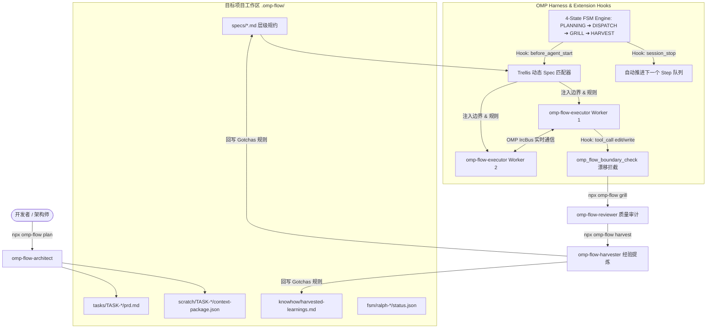

# omp-flow 🚀

> **原生支持 Oh-My-Pi (OMP) 的多 Agent 工作流编排框架**  
> **Multi-Agent Workflow Orchestration Framework powered by Oh-My-Pi (OMP)**  
> 融合 **Trellis**（分层规约上下文 & 动态提示词注入）与 **Maestro-Flow**（精简 4-State FSM 引擎、边界契约防漂移 & 增量 Harvest 踩坑闭环），实现零外部依赖、高并发、自进化的多 Agent 协作范式。

---

## 🌟 核心亮点 (Key Features)

- **⚡ 零外部运行依赖 (Zero External Dependencies)**
  纯 TypeScript 原生编写（NodeNext 模块），无需 Python、SQLite、C 编译扩展或向量数据库。一个 `npx` 指令开箱即用。

- **📂 统一 `.omp-flow/` 工作区 (Unified Workspace)**
  磁盘可追踪、人机共读。全 Markdown/JSON 结构管理需求 PRD、边界契约、层级规范与积累的 Gotchas 知识库。

- **🔄 精简 4-State FSM 驱动引擎 (Streamlined 4-State FSM)**
  收敛传统繁琐的 11 状态机，采用确定性的 **`PLANNING` ➔ `DISPATCH` ➔ `GRILL` ➔ `HARVEST`** 四阶段自动推进流水线，支持断点续跑。

- **🛡️ 静态 + 动态双重防漂移 (Dual-Layer Drift Protection)**
  前置注入 `<subagent-boundary-context>` 契约约束；运行时由 OMP `HookAPI` 实时拦截 `write`/`edit` 工具调用并进行通配符 Glob 路径匹配警报。

- **🧠 OMP 多模型分级调度 (Model Tiering)**
  根据 Subagent 职责自动匹配最佳模型档位：
  - `smol`（快速低成本）：用于状态查询、路由决策与边界 Check。
  - `default`（标准推理）：用于 Worker 的原子代码修改与单元测试。
  - `slow`（高推理大容量）：用于架构规划 PRD 编写与 Grill 质量审查。

- **🌾 踩坑闭环与自强化学习 (Self-Reinforcing Harvest Loop)**
  自动提取 Subagent Scratch 调试日志中的 Gotchas/Recipes，增量去重回写至 `knowhow/` 和 `specs/`，并在新会话启动时自动注入提示词，实现“越用越聪明”。


---

## 🎯 设计哲学 (Design Philosophy)

`omp-flow` 基于 **五大核心设计原则** 构建，确保质量内建于流程而非依赖事后修补：

### 1. 质量源于设计 (Quality by Design / QbD)

**在设计 & 计划阶段花费 $1 做预审，远比在编码阶段花费 $100 修 Bug 高效。**

每个 Task 启动前，`omp-flow-architect` 输出 `prd.md` + `design.md` 后，**QbD Advisor** 自动发起对抗式审计（Adversarial Audit），扫描边界漂移、一致性断裂和未定义验收条件。审计未通过则打回重写，绝不允许一份有漏洞的计划流入执行阶段。

```text
           $1 预审                          $100 修复
  ┌──────────────────┐               ┌──────────────────┐
  │  Plan + Review   │  ──→  Pass  ──→  Implement Code  │
  └──────────────────┘               └──────────────────┘
         ↑ 不合格打回                          ↑
         └──────────────────────────────────────┘
             质量内建，而非事后修补
```

### 2. 控制面与数据面解耦架构 (Control Plane vs Data Plane)

将任务控制流与详细数据表达彻底解耦，解决传统多文件框架（如 Trellis/Superpowers）文件膨胀与转义噩梦的问题：

```text
.omp-flow/tasks/<task-slug>/
├── prd.md                 <-- [业务与全局边界] 目标、Acceptance Criteria、Out-of-Scope (What)
├── design.md              <-- [QbD 架构设计] 方案、接口描述、关键决策 (How)
├── tasks.csv              <-- [控制面看板] 状态流转、波次、Tier、索引指向 .task/T*.md
└── .task/                <-- [数据面落地] 落地具体任务实现要求与测试硬证据
    ├── T1.md              <-- T1 的具体 Markdown 伪代码、长 Prompt、多轮答疑记录
    ├── T1.json            <-- T1 的 Reviewer 独立 Check 硬证据 (PASS/FAIL + test counts)
    ├── T2.md
    └── T2.json
```

| 层级 | 载体 | 职责 | 优势 |
|------|------|------|------|
| **控制面 (Control Plane)** | `tasks.csv` | 状态流转 (`pending`➔`in_progress`➔`done_with_concerns`➔`completed`)、波次排程、模型阶梯 (`tier`)、关联 `.task/T*.md` | 单一真理看板，解析高效，天然抗 Compaction |
| **数据面 (Data Plane)** | `.task/T*.md` | 详细 Markdown 指令、伪代码、长文字规范、多轮 `NEEDS_CONTEXT` 答疑记录 | 无 CSV 转义噩梦，表达力封顶，富文本亲和 |
| **硬证据落盘 (Check Evidence)** | `.task/T*.json` | 独立 Check 产生的 PASS/FAIL、`tests_run`、`tests_failed` 与 `file:line` 引用 | 机器可校验硬证据，替代动辄几千行的无用 diff |

### 3. 三工件任务包 (Three-Artifact Task Package)

每个任务由三个统一工件构成，**缺一不可**：

| 工件 | 职责 | 产出者 |
|------|------|--------|
| `prd.md` | 需求+约束+验收标准+边界 | `omp-flow-architect` |
| `design.md` | 技术设计+接口契约+数据流 | `omp-flow-architect` |
| `tasks.csv` | 控制面：原子步骤+模型阶梯+上下文索引 (`contextFiles`) | Task Seed Engine |

### 4. 精准上下文索引 (Precision Context Indexing)

通过 CSV 中的 `contextFiles` 列，**每一行 Step 只注入其真正需要的上下文文件**，杜绝全量读取导致的 Prompt 噪声：

```csv
id,wave,priority,title,scope,action,contextFiles,status,tier,taskMd
T1,1,P0,JWT Generation,src/core/auth.ts,"sign JWT","src/core/auth.ts;specs/sec.md",completed,default,.task/T1.md
T2,1,P0,401 Interceptor,src/mw/auth.ts,"return 401","src/mw/auth.ts",done_with_concerns,smol,.task/T2.md
```

- `contextFiles` 以分号分隔，Engine 自动读取并注入 `<row-context-files>` XML 块到 Subagent Prompt。
- 大型或二进制文件仅注入头部摘要。
- 零噪声 = 更低的 Token 消耗 + 更高的执行准确率。

### 4. 架构即强制 (Architecture as Enforcement)

**好的架构让正确的行为成为默认路径，让错误的路径无法抵达。**

设计原则内建于 FSM 和 CSV 流水线中，无需人工背诵：

| 强制机制 | 所保障的原则 | 违反后果 |
|-----------|-------------|---------|
| FSM `S_PLANNING` → `S_DISPATCH` 门控 | 先设计后编码 | Step 无法进入执行 |
| QbD Advisor 审计 `out_of_scope` 合规 | 边界不漂移 | Plan 被拒绝 |
| CSV 严格列格式 (`step_id`, `contextFiles`, `mode`) | TDD 与明确分工 | 解析失败报错 |
| 收敛条件 grep 可验证 | 拒绝模糊的"看起来可以" | 测试不通过 |

### 5. 人工审批门 (Human Approval Gate)

**在任何执行开始前，必须获得明确的计划批准。**

`S_DECISION_EVAL` 状态机阶段输出完整的 `DecisionGateVerdict`，包含计划摘要、风险评估和 Step 清单。系统 **等待** 人类确认后才开始派发 Wave。未经批准的 Plan 永不进入 `S_DISPATCH` 或 `S_WAVE_DISPATCH`。

```text
Plan Complete ──→ Decision Gate ──→ [APPROVED] ──→ Execute
                     ↓
                 [REJECTED]
                     ↓
             Revise & Re-plan
```
---

## 📂 工作区目录结构 (`.omp-flow/`)

```
.omp-flow/
├── specs/             # 项目架构规则、编码规范与 Harvest 沉淀的 Gotchas 规约
├── tasks/             # Task 需求 PRD (.omp-flow/tasks/TASK-*/prd.md) 及 .active-task
│   └── TASK-*/research/  # Researcher 子 Agent 持久化的调研报告
├── knowhow/           # 提炼的经验 Recipes 与 Gotchas 知识库
├── scratch/           # Context Package 契约包 (.omp-flow/scratch/TASK-*/context-package.json)
├── fsm/               # Ralph FSM 状态机持久化日志 (.omp-flow/fsm/ralph-*/status.json)
├── issues/            # 审计或测试失败自动创建的 Issue 追溯记录
├── workflow.md        # 项目全局工作流规范定义
└── state.json         # 项目全局 Phase、Milestone 与状态快照
```

---

## 🛠 7 大专职 Skill 技能包 (`.omp/skills/`)

执行 `npx omp-flow install` 会自动向当前项目的 `.omp/skills/` 注入全套模块化 Skill：

| Skill 技能名称 | 角色定位 | 核心职责 |
|---|---|---|
| 🎮 **`omp-flow`** | 主控控制器 | 暴露全局斜杠命令 (`/omp-flow:init`, `plan`, `execute`, `grill`, `harvest`, `status`)。 |
| 📐 **`omp-flow-architect`** | 系统架构师 | 解析高层需求，编写 PRD (`prd.md`)，构建包含 `in_scope`/`out_of_scope`/`done_when` 的契约包。 |
| 🔍 **`omp-flow-researcher`** | 调研员 | 只读代码与技术探索， findings **强制持久化写入** `tasks/{taskId}/research/*.md`。 |
| 🛠️ **`omp-flow-executor`** | 实施 Worker | Worker Subagent 核心技能，专注范围内代码编辑，通过 OMP `IrcBus` 实时协同。 |
| ⚖️ **`omp-flow-reviewer`** | 质量审计员 | 运行 `omp_flow_boundary_check` 检测代码漂移，审批 Step 完成状态 (`DONE` / `NEEDS_RETRY`)。 |
| 🌾 **`omp-flow-harvester`** | 经验收获员 | 扫描调试日志提取 Gotchas，回写至 `knowhow/` 和 `specs/` 实现经验归档。 |
| 🚑 **`omp-flow-debugger`** | 故障诊断员 | 当 Step 或测试失败时启动，分析日志并生成 Gap 修复微调 Plan (`--gaps`)。 |

---

## 📊 系统架构与多 Agent 协作流 (System Architecture)



---

## 📦 快速开始 (Quick Start)

### 安装与初始化

在任何 Node.js / TypeScript 项目根目录运行：

```bash
# 1. 初始化当前代码库的 .omp-flow/ 工作区
npx omp-flow init

# 2. 注入 OMP Extension 扩展与全套 7 大 Skill 技能包
npx omp-flow install
```

### 任务生命周期操作

```bash
# 3. 规划新任务 (生成 PRD 需求与 Context Package 边界契约)
npx omp-flow plan "构建用户 JWT 认证与 Middleware" --task TASK-001

# 4. 自动推进 FSM 状态机队列，调度 Worker Subagents 并行执行代码编写
npx omp-flow execute

# 5. 对完成的 Step 开展代码漂移与质量 Review
npx omp-flow grill --step 1 --status DONE

# 6. 提炼本任务踩坑经验并沉淀至规范库
npx omp-flow harvest

# 7. 随时查看项目 Milestone、Phase 及状态机进度
npx omp-flow status
```

---

## 🛠 命令行参数说明 (CLI Usage)

```bash
omp-flow <command> [options]

Commands:
  init                       初始化 .omp-flow/ 工作区目录结构
  install                    向 .omp/ 注入 Extension 与 7 大 Skill 技能包
  plan [intent] --task [id]  生成任务 PRD 需求文档与 Context Package
  execute                    推进 Ralph FSM 状态机并启动下一个 Step
  grill --step [n] --status  质量审查并设置 Step 状态 (DONE|NEEDS_RETRY|BLOCKED)
  harvest                    提取 Scratch 调试日志中的 Gotchas 到 knowhow 与 specs
  status                     显示当前项目 Milestone、Phase 及 Ralph FSM 步骤快照
  help                       显示帮助信息
```

---

## 📄 License
MIT © 2026 omp-flow Maintainers
