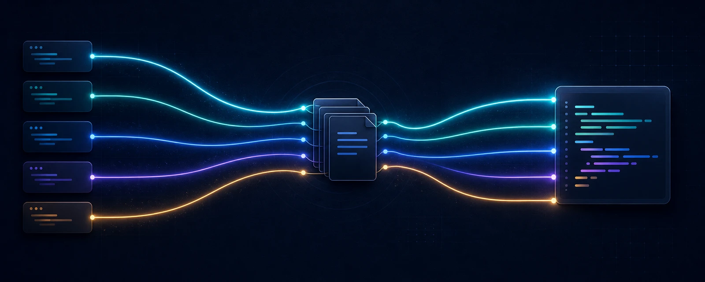

<div align="center">

# omp-flow

**把调查、设计、实现与独立复核沉淀为项目本地、Git 可追踪的知识。**

中文 · [English](README_EN.md)

[](https://www.npmjs.com/package/omp-flow)
[](https://github.com/Andyduck-ops/omp-flow)
[](LICENSE)



<sub>任务知识留在 Git 可见的 Markdown 中；模型、原生 Agent、并发与 UI 留在你的 Harness 中。</sub>

</div>

## 快速开始

全局安装 CLI：

```bash
npm install -g omp-flow@latest
```

进入项目并初始化。`-u` 只设置当前仓库的 Git `user.name`：

```bash
cd <your-project>
omp-flow init -u "Your Name"
```

交互面板会列出 Oh My Pi、Codex、Claude Code、Snow 和 Cursor，首次初始化默认全选；用空格切换，回车确认。然后在项目中打开任一已选 Harness，像平常一样描述要完成的工作，项目本地指令会引导它使用 omp-flow。

以后更新全局 CLI 和项目内受管文件：

```bash
npm install -g omp-flow@latest
cd <your-project>
omp-flow update
```

建议先预览：

```bash
omp-flow update --dry-run
```

`--dry-run` 只打印计划，不写文件。计划中的 `new` 会创建新模板，`autoUpdate` 表示项目副本
仍等于上次安装版本、可以安全升级，`unchanged` 会跳过；`changed` 表示项目副本已经有本地
差异，默认询问覆盖、保留或另存为 `.new`。如果希望保留全部本地差异，同时继续创建 `new`
并执行 `autoUpdate`，使用：

```bash
omp-flow update --skip-all
```

只要计划会写文件，更新前会把现有受管文件备份到 `.omp-flow/.backup-<timestamp>/`。
Task Bundle、Wiki、Learn 中用户新增的 Daily/Thread/Retrospective 内容，以及运行时数据都
不是模板覆盖目标；Learn 的四个入口 `index.md` 属于受管模板，若有本地修改则同样按
`changed` 处理。被用户主动删除的受管文件会保持删除，除非显式选择重新创建。`--force`
会覆盖所有 `changed` 文件，不建议作为日常更新命令。

无交互环境才需要 `--omp`、`--codex`、`--claude`、`--snow` 或 `--cursor`；日常使用不必记这些参数。

## Flow Status 状态面板

Flow Status 的 Task/Flow 状态采集、校验和只读 Skill 已包含在项目资源中。你可以在支持的
Harness 中直接让 Agent“查看当前 Flow Status”，或者在终端运行：

```bash
omp-flow status
```

但 `0.3.x` 当前发布包还没有完成状态面板的普通用户安装闭环：`omp-flow update` 会更新
Flow Status 的 runtime、Hooks 和 Skill，**不会自动安装 Claude Code 的两行持久状态栏**。
公开 CLI 中的 `flow-status setup|update` 是需要精确 provider 路径和 ownership 参数的底层
接口；其兼容状态栏产物尚未作为公开 npm 包提供，因此目前不建议普通用户手工调用。

一键安装正在按下面的产品路径完成：选择 Claude Code 后由 `omp-flow init` 默认配置状态栏，
已有项目可重跑 `init` 补装，之后由 `omp-flow update` 维护精确属于 omp-flow 的状态栏文件；
用户自有或已修改的 `statusLine` 会保留并报告冲突。在这条路径正式发布前，README 不会提供
一组实际上无法独立完成安装的内部命令。

## omp-flow 做什么

omp-flow 为多 Agent 开发提供可移植的方法与很小的机械内核，同时保留每个 Harness 的原生执行体验。

| 边界 | 所有者 | 职责 |
| --- | --- | --- |
| Task Bundle 与 Concepts | Git 可追踪的 Markdown | 保存问题、来源、需求、设计、决定、工作、交接与复核 |
| `.omp-flow` Python runtime | omp-flow | 只保证 session、路径、actor、锁、原子操作和不透明 receipt |
| 原生执行 | 你的 Harness | 继续负责模型、Agent 派发、并发、进度、取消、隔离与 UI |

因此，omp-flow 不会把 Markdown 解析成生命周期数据库，也不会接管平台的模型或调度系统。

## 支持的 Harness

| Harness | 项目本地集成 |
| --- | --- |
| Oh My Pi | 扩展、原生 Agent、Skills 与设置 |
| Codex | 原生 Agent、Hooks 与共享 Skills |
| Claude Code | 原生 Agent、Hooks、Skills 与设置 |
| Snow | 原生 Agent、Hooks 与共享 Skills |
| Cursor | 原生 Agent、Hooks 与共享 Skills |

初始化只安装你选择的集成；任务知识仍是一套可移植的 Bundle。

## 工作流概览

```text
brainstorm ↔ research → design → QbD → work map → QbD → implementation → review → finish
```

这是一条推理方向，不是 runtime phase state。证据可以让工作回到 framing 或 design；实现结果也必须经过不同 actor 的独立复核。完整语义见 [workflow.md](templates/.omp-flow/workflow.md)。

## 项目知识与文档系统

omp-flow 把不同生命周期和可信度的知识分开放置，但全部保持为普通 Markdown：

| 位置 | 用途 | 边界 |
| --- | --- | --- |
| `.omp-flow/tasks/<task>/` | 当前任务的问题、来源、需求、设计、决定、交接与复核 | 属于一个具体 Task Bundle；完成后可归档 |
| `.omp-flow/wiki/` | 跨任务复用的架构、约定、经验与项目事实 | 只保存已有证据支持、值得长期维护的知识 |
| `.omp-flow/learn/` | 人与 Agent 共同学习时形成的可恢复理解 | Daily 记录有价值的当次学习；Thread 延续跨次主题；Retrospective 保留重要反思 |
| `.omp-flow/sleep/` | 从已归档 Task 提炼出的跨任务知识候选 | Candidate 必须复核后才能进入 Wiki，不会自动晋升 |

`omp-flow init` 和 `omp-flow update` 会安装并维护这些目录所需的模板、Skills 与运行时。
Learn 没有额外的开始/保存命令：当你明确希望一起理解、解释、质疑或复盘时，Agent 会按需维护
`.omp-flow/learn/`，而不是保存整段聊天、打分或制造第二套任务系统。

任务完成并归档后，Sleep 可以读取那个精确的 Git checkpoint，生成零个或多个可审查的
Candidate。它不会读取原始 Harness transcript，也不会使用向量聚类自动改写 Wiki；最终是否
沉淀为长期项目知识仍由人和 Agent 根据证据判断。

```text
Task Bundle → finish / archive → Sleep Candidate ──人工复核──→ Wiki
         人与 Agent 的共同理解与纠正 ───────────────→ Learn
```

`0.3.0` 同时更新了共享 Workflow Skills 与各 Harness 的原生 Agent 指令，使 Brainstorm、
Research、Design、QbD、Implementation、Review 和 Finish 更强调实践证据、独立复核、
可恢复 assignment，以及人类决定与模型判断之间的边界。

## 致谢


- 项目保留并修改了固定版本的 [ccstatusline](https://github.com/sirmalloc/ccstatusline/tree/83c8ffd551ec700fceeed98fe9ab50de84cb49fa) 软件；其上游授权与声明随集成一同保存。

## 许可证

omp-flow 采用 [MIT License](LICENSE)，版权声明为 `Copyright (c) 2026 Andyduck-ops`。

ccstatusline 集成继续适用其独立的 [LICENSE](integrations/ccstatusline/LICENSE) 与 [NOTICE](integrations/ccstatusline/NOTICE)。

## 友情链接

[Linux DO](https://linux.do/)
